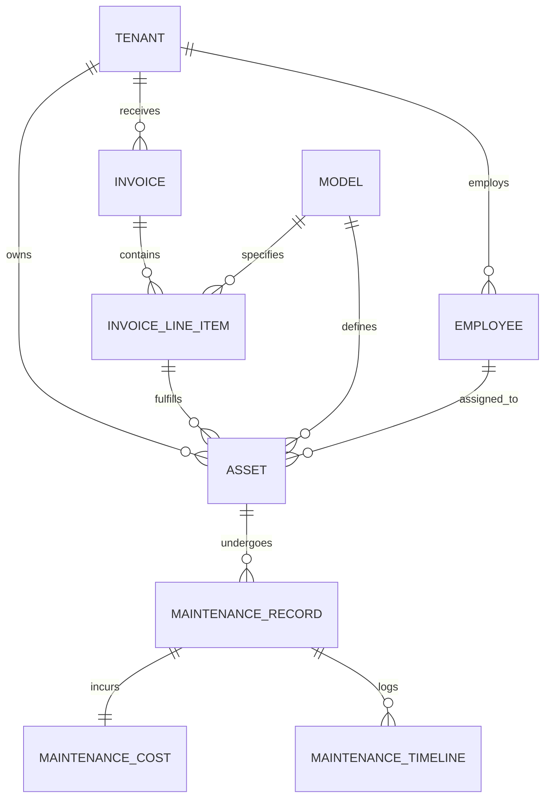

# Database Schema Specification v3.0 (Production-Ready)

This document defines the finalized database schema for the Simple IT Inventory App. It has been refactored for high-performance ASP.NET Core / EF Core implementation, supporting multi-tenancy, full auditability, and optimistic concurrency.

---

## 1. Architectural Design Principles

-   **Multi-Tenancy:** Every table contains a `TenantId` to ensure logical data isolation.
-   **Audit Trail:** Mandatory temporal and user tracking on every record.
-   **Financial Integrity:** Procurement is tracked via `InvoiceLineItems` to handle bulk purchases and unit pricing accurately.
-   **Maintenance History:** Maintenance records use JSONB snapshots to preserve asset state (e.g., Specs, CPU, RAM) at the time of repair, preventing historical data drift if a model is updated later.
-   **Concurrency:** Optimistic concurrency control is implemented via `RowVersion` tokens.

---

## 2. Entity Relationship Diagram (ERD)



---

## 3. Global Standard Columns

All tables defined below implicitly include these six mandatory columns. They are omitted from individual tables for brevity but **MUST** be implemented.

| Column      | Type                 | Nullability | Description                                          |
| ----------- | -------------------- | ----------- | ---------------------------------------------------- |
| `TenantId`  | `UniqueIdentifier`   | NOT NULL    | Multi-tenancy partition key.                         |
| `CreatedAt` | `DateTimeOffset`     | NOT NULL    | Record creation timestamp.                           |
| `CreatedBy` | `NVARCHAR(255)`      | NOT NULL    | User ID who created the record.                      |
| `UpdatedAt` | `DateTimeOffset`     | NOT NULL    | Last update timestamp.                               |
| `UpdatedBy` | `NVARCHAR(255)`      | NOT NULL    | User ID who last updated the record.                 |
| `RowVersion`| `Timestamp/RowVersion` | NOT NULL    | Concurrency token for EF Core.                         |

---

## 4. Table Definitions

### 4.1. Core Inventory & Personnel

#### Tenants
Stores organizational units/customers.
- **Id**: `UniqueIdentifier` (PK)
- **Name**: `NVARCHAR(200)` (Unique)
- **IsActive**: `BIT` (Default: 1)

#### Employees
- **Id**: `NVARCHAR(100)` (PK)
- **FullName**: `NVARCHAR(200)`
- **Email**: `NVARCHAR(255)`
- **Department**: `NVARCHAR(100)` (Indexed)
- **Position**: `NVARCHAR(100)`

#### Models
Hardware templates/specifications.
- **Id**: `INT` (PK, Identity)
- **Name**: `NVARCHAR(200)`
- **Make**: `NVARCHAR(100)`
- **Category**: `NVARCHAR(50)` (e.g., Laptop, Monitor)
- **Specs**: `JSONB / NVARCHAR(MAX)` (Typed schema based on Category)

#### Assets
- **Id**: `INT` (PK, Identity)
- **ServiceTag**: `NVARCHAR(100)` (Unique per Tenant)
- **ModelId**: `INT` (FK -> Models)
- **State**: `INT` (Enum: New, Good, Fair, Broken)
- **EmployeeId**: `NVARCHAR(100)` (FK -> Employees, Nullable)
- **Location**: `NVARCHAR(100)`
- **InvoiceLineItemId**: `INT` (FK -> InvoiceLineItems, Nullable)
- **WarrantyExpiry**: `DateTimeOffset` (Nullable)
- **IsDeleted**: `BIT` (Soft delete flag)

### 4.2. Procurement (Financials)

#### Invoices
- **Id**: `INT` (PK, Identity)
- **InvoiceNumber**: `NVARCHAR(100)`
- **Vendor**: `NVARCHAR(200)`
- **PurchaseDate**: `DateTimeOffset`

#### InvoiceLineItems
Supports bulk procurement.
- **Id**: `INT` (PK, Identity)
- **InvoiceId**: `INT` (FK -> Invoices)
- **ModelId**: `INT` (FK -> Models)
- **Quantity**: `INT`
- **UnitPrice**: `DECIMAL(18,2)`
- **TaxAmount**: `DECIMAL(18,2)`

### 4.3. Maintenance Tracking

#### MaintenanceRecords
- **Id**: `INT` (PK, Identity)
- **AssetId**: `INT` (FK -> Assets)
- **AssetSnapshot**: `JSONB` (Stores Model, Specs, and Owner info at time of ticket)
- **Issue**: `NVARCHAR(500)`
- **Priority**: `INT` (Enum: Critical, High, Medium, Low)
- **Status**: `INT` (Enum: Pending, InProgress, Completed)
- **TechnicianId**: `NVARCHAR(255)`

#### MaintenanceCosts
Unified financial source for repairs.
- **Id**: `INT` (PK, Identity)
- **MaintenanceRecordId**: `INT` (FK -> MaintenanceRecords, Unique)
- **EstimatedCost**: `DECIMAL(18,2)`
- **ActualPartsCost**: `DECIMAL(18,2)`
- **ActualLaborCost**: `DECIMAL(18,2)`
- **TotalActualCost**: Computed (Parts + Labor)

---

## 5. Indexing & Performance Plan

### 5.1. Dashboard Optimization
To support `GET /dashboard/stats` efficiently:
- **`IX_Assets_TenantId_Category_State`**: Composite index to allow rapid grouping and counting of stock levels.
- **`IX_Maintenance_TenantId_Status`**: Quick filtering for pending vs completed tickets.

### 5.2. Search & Filtering
- **`IX_Assets_TenantId_ServiceTag`**: Unique covering index for fast individual lookup.
- **`IX_Employees_TenantId_Email`**: Unique index for personnel lookups.

---

## 6. EF Core Mapping Guide

### 6.1. Global Query Filters
Configure in `OnModelCreating` to enforce multi-tenancy and soft deletes automatically:
```csharp
builder.Entity<Asset>().HasQueryFilter(a => a.TenantId == _currentTenantId && !a.IsDeleted);
```

### 6.2. JSON Mapping
Map `Models.Specs` and `MaintenanceRecords.AssetSnapshot` using the `.ToJson()` extension (EF Core 7+):
```csharp
builder.Entity<Model>().OwnsOne(m => m.Specs, b => { b.ToJson(); });
```

### 6.3. Concurrency Tokens
Apply to the `RowVersion` shadow property:
```csharp
builder.Entity<Asset>().Property(a => a.RowVersion).IsRowVersion();
```

### 6.4. Shadow Properties for Auditing
Use a base class or interface `IAuditable` and configure via reflection in `OnModelCreating` to map the standard columns without polluting the domain models unless necessary.